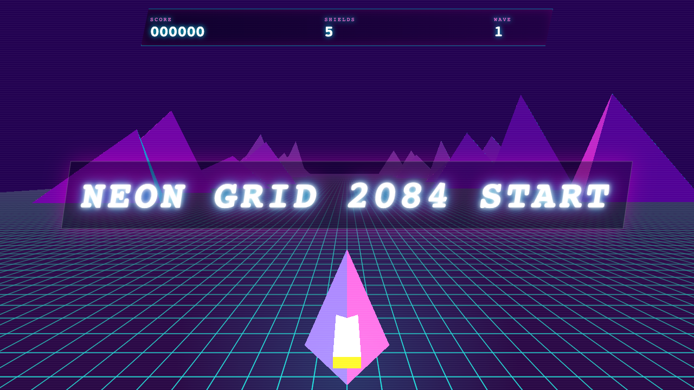

# Neon Grid 2084

A tiny Rust/WASM arcade game



Pilot a neon ship across the grid, dodge incoming hazards, ride toward the horizon, and grab shield pickups when the wave starts getting spicy.

Controls:

- `A` / `D` or arrow keys: steer left and right
- `W` / up arrow or space while riding: boost
- Space / Enter: start or restart
- `P`: pause

## Build

Install the Rust WebAssembly target and the `wasm-bindgen` CLI once:

```sh
rustup target add wasm32-unknown-unknown
cargo install wasm-bindgen-cli --version 0.2.122
```

Install Caddy if you want to use the included serve recipes:

```sh
brew install caddy
```

Then build the demo:

```sh
just build
```

Serve the directory with any static file server:

```sh
just serve
```

Then open http://127.0.0.1:8080/.

You can also run `just dev` to build and serve in one step.
